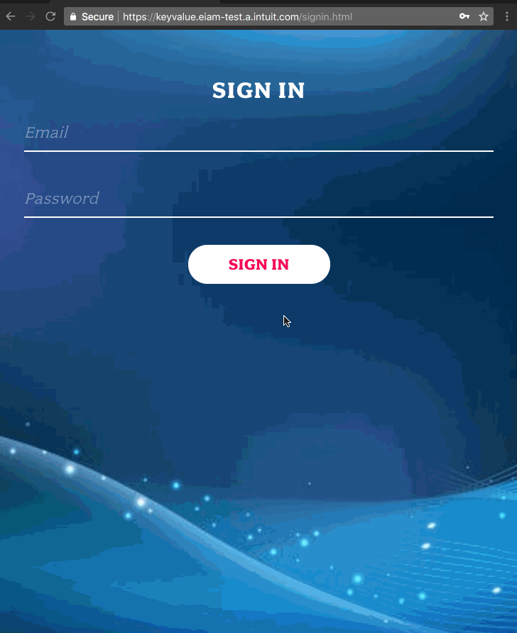

# LambdaKeyValue

	
## KeyValue Service
Key Value Service is an API which can generate key value and retrieves whenever user requests back. This API can be invoked only with Cognito "Authorization" Header. 

## Deployment Instructions
1. Build code
2. Upload the Binary file to respective account S3 bucket binary files repo
		for e.g. golang-bin-repo-132497850436-us-west-2
3. Comment **KeyValueAPIBasePathMapping** resource in the template.yml [There is an issue where basepathmapping can not be created in first deployment using 	SAM because of circular dependency. For more info: https://github.com/awslabs/serverless-application-model/issues/119
4. Upload custom domain name certificate in ACM specific regions (west-2 and also east-2) and note down the certificate ARN.
5. Deploy SAM Template using following command

	aws cloudformation deploy --template-file template.yml --stack-name KeyValueService --parameter-overrides KeyValueCertArnId=[CertArn Goes Here] HostedZoneName=[One of the allowed Hosted Zone Name] RecordName=[One of the allowed Record Name] stageName=[One of the allowed Stage Name] codeRepoBucketName=[Code repo bucket name] binFileKeyName=[jar file name including version] domainName=[One of the allowed domain name] --capabilities CAPABILITY_IAM
	
6. Uncomment **KeyValueAPIBasePathMapping** resource in the template.yml and run the above command again.
7. Repeat same steps from 3 to 5 and deploy it in US-EAST-2 region.
8. Deploy Route 53 DNS Record to place US-WEST-2 and US-EAST-2 end points under custom domain name record [Replace with values as per your environment]

		aws cloudformation deploy --template-file dns-record-healthcheck.yaml --stack-name KeyValueDNSRecord --parameter-overrides Region1HealthEndpoint=[HealthEndpoint] Region2HealthEndpoint=[HealthEndPoint2] Region1Endpoint=[RegionEndpoint1] Region2Endpoint=[RegionEndpoint2] HostedZoneId=[HostedZoneId] MultiregionEndpoint=[URL]

9. Demo

## Special Instructions
1. Enable GlobalTable on DynamoDB before any data gets inserted into table
2. DNS Record template is based on https://github.com/aws-samples/blog-multi-region-serverless-service/blob/master/helloworld-dns/helloworld-dns.yaml
	
	
